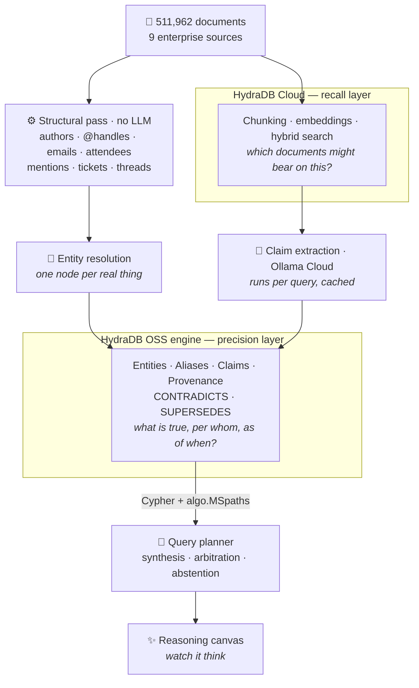

<div align="center">

# Glasshouse

**An enterprise ontology you can see through.**

Nine enterprise tools disagree about who owns what. Glasshouse resolves the
identities, arbitrates the contradictions, admits when the answer isn't there —
and shows its work while it does.

Half a million messy documents from nine SaaS tools, made queryable as one
ontology — with entity resolution, conflict arbitration, and honest abstention,
all visible as it happens.

[](LICENSE)
[](pyproject.toml)
[](https://hydradb.com)
[](https://hackhydra.hydradb.com)

</div>

---

## The problem

Give a search engine half a million documents from Slack, Gmail, Linear, Google
Drive, HubSpot, Fireflies, GitHub, Jira and Confluence, and it will happily find
you a document. That is not the hard part.

The hard part is what the Hack Hydra Track 01 brief says out loud:

> *"Extraction is the easy part now that LLMs are cheap. The hard part is entity
> resolution and ontology alignment: deciding that "Sam", "@soham" and
> "S. Ratnaparkhi" are one person, and figuring out which of two contradictory
> statements to trust."*

Four things follow from that, and Glasshouse is built around them.

| | |
|---|---|
| **One node per real thing** | `@priya`, `priya_nair@redwood.com` and `Priya Nair` are one person. Get this wrong and every question about her returns a fraction of the answer. |
| **Every fact carries its source** | Not *"Sam owns billing"* but *"Sam owns billing — per this Confluence page, dated March 3."* Receipts, not vibes. |
| **Disagreements are kept, not hidden** | When two documents conflict, both survive. One wins, and the reason it won is shown. |
| **Knowing when to shut up** | If the answer genuinely is not in the corpus, say so — while still surfacing what *is* known. |

---

## Architecture

Glasshouse uses **both** HydraDBs, because they solve different halves of the
problem.



**Why both.** The managed cloud API gives us recall over the full corpus for free
and saves a week of embedding infrastructure — but it does not let you define
node types, edge types, or temporal versioning, which is exactly what an ontology
*is*. The open-source engine does: OpenCypher over a property graph, with native
multi-hop path procedures. So recall goes to the cloud, and the ontology lives in
the engine.

---

## The ontology

Six node types and one materialised traversal edge.

```cypher
(:Entity   {eid, type, canonical_name, confidence})
(:Alias    {surface, source, occurrences})  -[:RESOLVES_TO {confidence, method}]-> (:Entity)
(:Document {doc_id, source, ts, title, author_alias, thread})

(:Claim    {claim_id, predicate, object_value, ts_asserted, trust, status})
   -[:SUBJECT]->(:Entity)   -[:OBJECT]->(:Entity)
   -[:EVIDENCED_BY]->(:Document)
   -[:CONTRADICTS]->(:Claim) -[:SUPERSEDES]->(:Claim)

(:Entity)-[:RELATES {type, claim_id, trust, ts}]->(:Entity)
```

Three decisions worth calling out:

**Contradictions are never deduplicated.** Competing claims both persist, joined
by `CONTRADICTS`, with `SUPERSEDES` forming a temporal chain and `status` marking
the current winner. This is what makes conflicts answerable *and* auditable.

**Trust is predicate-aware, not source-ranked.** The naive rule — official docs
beat chat — gets this backwards. A Slack message from last week beats an
eight-month-old Confluence page when the fact is volatile:

```
trust = w_src·authority(source) + w_rec·decay(age, predicate)
      + w_cor·log(1 + corroborations) + w_role·authority(author) + w_exp·explicitness
```

Weights shift by predicate class — *volatile* facts (owner, status, price) lean on
recency; *stable* facts (reports_to, founded) lean on source authority.

**Abstention has three gates**, each a different honest answer:

| Gate | Condition | Response |
|---|---|---|
| Linking | the entity does not resolve | *no such thing in the corpus* |
| Connectivity | entities resolve, nothing connects them | *not recorded* |
| Confidence | claims exist but trust is below threshold | *insufficient evidence* |

Each emits related context **plus** an explicit statement of what is missing —
a caveated partial answer, not a bare refusal.

---

## Watch it think

The hard work in this track is invisible. Resolution and arbitration happen in a
pipeline, so a demo otherwise looks like every other chat box. Glasshouse
animates the reasoning instead:

1. **Landing** — query terms drop onto the canvas; matched aliases visibly collapse into one entity
2. **Walking** — edges light one hop at a time; dead ends fade
3. **Evidence** — each committed node pops out its citation
4. **Conflict** — contradicting claims pulse, one dims, the winner locks in with its reason
5. **Answer** — or, when unanswerable, the search fans out, finds nothing, and says so

It stays fast because **we never draw the whole graph** — only the 10–40 nodes the
agent actually touched. Canvas 2D plus a small force simulation, no heavy graph
library.

---

## Status

Built in the open during Hack Hydra, 12–20 August 2026. Honest state of play:

- [x] **Session 0** — all three layers verified against live systems
- [x] **Session 1** — 511,962 documents normalised in 36s, 19 parser tests green
- [ ] **Session 2** — full-corpus ingestion into HydraDB Cloud
- [ ] **Session 3** — entity resolution
- [ ] **Session 4–6** — graph loader, claim extraction, conflict + trust
- [ ] **Session 7–9** — query planner, abstention, evaluation
- [ ] **Session 10–11** — reasoning canvas, ship

### Coverage, stated precisely

Corpus scale is the dataset's property, not an achievement — every Track 01
entry gets the same documents. What matters is what is actually done to them, and
that differs by tier. Claim extraction runs **per query**, by design, so no part
of this claims to have deeply read half a million documents:

| Tier | Coverage | What happens | Status |
|---|---|---|---|
| Normalisation | all 511,962 | parsed, structural signals mined, no LLM | done — 36s |
| Recall indexing | all 511,962 | embedded and searchable | Session 2 |
| Identity resolution | all 511,962 | aliases clustered into entities | Session 3 |
| Claim extraction | per query | LLM reads only what the question reaches | Session 5 |

### What the corpus actually looks like

| Source | Docs | Source | Docs |
|---|---:|---|---:|
| Slack | 285,605 | HubSpot | 15,017 |
| Gmail | 121,390 | Fireflies | 10,173 |
| Linear | 35,308 | GitHub | 8,052 |
| Google Drive | 25,108 | Jira | 6,120 |
| Confluence | 5,189 | **Total** | **511,962** |

The whole corpus is normalised in **36 seconds** without a single LLM call,
yielding **1.9M** name↔email pairs, **953k** speaker turns, **291k** @mentions,
and **7,890** bot accounts filtered out of the people pool.

That speed is the point: identity resolution — the thing this track actually
scores — turns out to need almost no LLM. Handles, emails, author fields and
attendee blocks are *structured*. So full-corpus identity coverage is nearly
free, and the expensive model calls are spent only where reasoning is required.

Entity-resolution working set: **36,752** surfaces seen five or more times.
91.6% of email addresses appear exactly once — a long tail of one-off external
contacts that no amount of compute would make worth resolving.

> **Meeting transcripts are the most underrated source in an enterprise.** They
> carry full names in timestamped turns, tie those names to an *organisation*, and
> name people who never speak. That is what bridges a bare Slack handle to a real
> human with an email address.

---

## Evaluation, and not cheating at it

Scored against [EnterpriseRAG-Bench](https://github.com/onyx-dot-app/EnterpriseRAG-Bench)
— 600 questions across basic retrieval, multi-hop reasoning, aggregation,
conflicting information, completeness, and information-not-found.

Every question runs **twice**: once through plain search (what a normal RAG app
does) and once through the graph pipeline. Same questions, per-category. If the
graph does not beat plain search on multi-hop, conflicts and not-found, that is a
finding we report rather than bury.

**The benchmark ships with an answer key, and it is kept out of this repository.**

- Gold records live outside the repo at `$GOLD_ANSWERS_PATH`, read only by the
  scoring harness — never by the pipeline
- The repo carries only `question_id` and question text
- `question_type` and `source_types` are withheld too: `info_not_found` tells a
  system to abstain before doing any work, and `source_types` tells it where to
  look. Both are restored only at scoring time
- Extraction scope is decided by the runtime query, never by gold labels

It would be easy to scope extraction to the gold documents and post excellent
numbers. It would also be worthless.

---

## Getting started

```bash
git clone https://github.com/Shrujal00/glasshouse-hydradb.git
cd glasshouse-hydradb

cp .env.example .env      # add your HydraDB and Ollama keys
python -m venv .venv && .venv/bin/pip install -e ".[dev]"

docker compose up -d      # HydraDB OSS engine
python scripts/fetch_corpus.py
python scripts/intake.py
```

**Requirements:** Docker, Python 3.11+, a [HydraDB](https://app.hydradb.com) API
key (Ship tier is free), and an [Ollama Cloud](https://ollama.com) key.

---

## Attribution

Built by **[Shrujal Ganatra](https://github.com/Shrujal00)** for Hack Hydra 2026.
[LinkedIn](https://www.linkedin.com/in/shrujal-ganatra/)

Licensed under **Apache-2.0**. You are free to clone, fork and build on this — the
[`NOTICE`](NOTICE) file must travel with any derivative, and the licence grants no
rights to use the author's name or branding to endorse your fork.

**Third-party:**

- [HydraDB](https://github.com/hydra-db/hydradb) — AGPL-3.0, run as a separate
  containerised service, not linked into this codebase
- [EnterpriseRAG-Bench](https://github.com/onyx-dot-app/EnterpriseRAG-Bench) by
  Onyx — not redistributed here, fetched by script
- [Salesforce HERB](https://huggingface.co/datasets/Salesforce/HERB) —
  CC-BY-NC-4.0, research and non-commercial use only, not redistributed
- [Ollama](https://ollama.com)

<div align="center">
<sub>Built in public, 12–20 August 2026.</sub>
</div>
