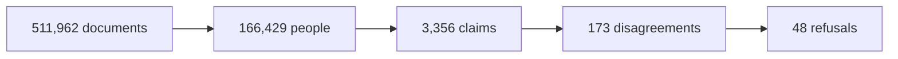

<div align="center">


# Glasshouse

**Nine tools. One company. Three different answers.**

Your company writes the same fact down in nine places. Over time those copies
drift apart, and nobody notices — because nobody is looking.
Glasshouse looks.

[](LICENSE)
[](pyproject.toml)
[](https://hydradb.com)
[](https://hackhydra.hydradb.com)

**[Live site](https://shrujal00.github.io/glasshouse-hydradb/)**

</div>

---

## How it's built

**Five pieces, each doing one job.**

| | Piece | Its one job |
|:-:|---|---|
| 🔶 | **HydraDB engine** *(self-hosted)* | Holds who everybody is and what disagrees with what. Every question about people or contradictions is answered here. |
| ☁️ | **HydraDB Cloud** | Finds which documents are worth reading, even when the question and the page share no words. |
| 🔍 | **SQLite** | Plain keyword search over all 511,962 documents. The fast, boring baseline. |
| ⚖️ | **`trust.py`** | Decides who's right when two tools disagree — **no model involved**, just arithmetic. |
| 💬 | **Ollama** | Reads claims out of text, and writes the final answer in English. |

### What happens when you ask something

```
your question
     │
     ├──► keyword search ─────────────┐
     │                                │
     ├──► HydraDB: your words ────────┤    all three run
     │    become every name form      │    at the same time
     │                                │
     └──► HydraDB: walk into ─────────┘
          the folder you named
                                      │
                                      ▼
                          the handful worth reading
                                      │
                                      ▼
                   claims pulled out, then arbitrated
                                      │
                    ┌─────────────────┴─────────────────┐
                    ▼                                   ▼
              a cited answer                    "I don't know",
                                                 and why not
```

Three doors open at once and the **live trace shows you which one found the
page** — so the graph has to earn its place on every single answer.

### The one that matters

Most of this is ordinary. This part isn't:

> **"What does this company contradict itself about?"**

There is no way to type that into a search box — nobody asked a question, so
there is no word to search for. But contradiction is stored as a **connection
between two claims**, so it's just one query.

| | HydraDB | Keyword search |
|---|---|---|
| Who is `elliot price`? | 1 person, 7 written forms · **18ms** | 20 documents |
| Which pages are in this space? | 236, out of 511,962 · **8ms** | 20 documents |
| **What do we contradict ourselves about?** | **173 disagreements · 13ms** | 20 documents |
| Who read the version that was wrong? | 7 people · claim → doc → person | 20 documents |

Keyword search answers all four with a pile of documents — which isn't an
answer to any of them.

Run it yourself: `python scripts/graph_queries.py`

---

## The idea in one screen

Glasshouse read **511,962 documents** from Slack, Gmail, Jira, Confluence,
GitHub, Drive, HubSpot, Linear and Fireflies.

Then it did three things:

| | | |
|---|---|---|
| **1** | **Worked out who everyone is** | 401,163 different ways of writing a name became **166,429 real people** |
| **2** | **Pulled out what each tool claims** | "Benji owns ENG-4824" — with the source and the date attached |
| **3** | **Found where those claims fight** | **173 disagreements**, found before anyone asked a question |

And on 48 of those 173, it says **"I don't know"** — because two equally
trustworthy sources disagree, and the honest answer is that the company hasn't
actually decided.

---

## What that looks like

> **ENG-4824 · who owns this?**
>
> Confluence says **Benji Okafor and Sofia Ivanova** — trust 0.958
> Slack says **Liam and Maria** — trust 0.900
>
> *trust is too close to choose: 0.958 against 0.900 is a gap of 0.058, and 0.06
> is the least that would settle it*

No model was asked. That verdict is arithmetic — how trustworthy the source is,
how recent it is, how many others agree — so the same claims settle the same way
every single time.

---

## Contents

- [How it's built](#how-its-built)
- [How HydraDB is used](#how-hydradb-is-used)
- [Getting started](#getting-started)
- [How it works](#how-it-works)
- [What's in the code](#whats-in-the-code)
- [Speed](#speed)
- [Results](#results)
- [Attribution](#attribution)

---

## How HydraDB is used

Twice, for two different jobs. **Turn either off and the product stops working.**

### 1 · The engine — where the thinking happens

Self-hosted in Docker. It holds who everybody is, and what disagrees with what.

Not a schema dump — here is what is actually in there:

| What | How many |
|---|---|
| **People** — one node per real human | 166,429 |
| **Name forms** — every way a person was ever written | 209,388 |
| **Documents** — one per message, file or page | 511,962 |
| **Places** — folders, channels, spaces | every container |
| **Claims** — "X owns Y", with proof attached | 3,356 |
| **Disagreements** — two claims that can't both be true | 173 |
| **Connections between them** | 978,512 |

And how they connect, in plain words:

- a **name form** *means* a person
- a **person** is *mentioned in* a document
- a **document** *lives in* a place
- a **claim** is *backed by* a document
- a **claim** *contradicts* another claim
- a **newer claim** *replaces* an older one

Because it's a graph, questions that would normally be impossible become one hop:

| Ask this | It does this | Takes |
|---|---|---|
| Who is `@jae`? | follows one name form to the person | **0.09s** |
| Which pages are in this space? | walks into the folder | **159,030 docs → 6** |
| What do we contradict ourselves about? | reads the disagreements | **0.06s** |
| Who read the version that was wrong? | claim → document → people | **3 hops** |

That third one is the point. **Nobody typed a question.** You cannot ask a
search box "what does this company disagree with itself about" — there's nothing
to search for. A graph can just answer it.

### 2 · The cloud — finding the right page

HydraDB Cloud does the document search. Its hybrid retrieval means a question
that says *"too many requests errors"* still finds the page that only ever says
`429`. Keyword search can't do that.

---

## Getting started

You need **Python 3.11+**, **Docker**, and an **Ollama key**.

```bash
git clone https://github.com/Shrujal00/glasshouse-hydradb.git
cd glasshouse-hydradb

python -m venv .venv && .venv/bin/pip install -e ".[dev]"
cp .env.example .env          # fill in your keys
docker compose up -d          # start the HydraDB engine
.venv/bin/python -m pytest    # 183 tests, no network needed
```

Then run it:

```bash
.venv/bin/python -m uvicorn glasshouse.server:app \
    --host 127.0.0.1 --port 8080 --app-dir src
```

Open **http://127.0.0.1:8080**. It lands on the disagreement map.

<details>
<summary><b>Keys you can set</b></summary>

| Variable | Required | What for |
|---|---|---|
| `HYDRA_LOCAL_TOKEN` | yes | the local engine — 32+ characters |
| `HYDRA_HTTP_URI` | yes | defaults to `http://127.0.0.1:8443` |
| `OLLAMA_API_KEY` | yes | reading claims out of text, writing answers |
| `HYDRA_DB_API_KEY` | no | HydraDB Cloud search |
| `GOLD_ANSWERS_PATH` | no | grading only — kept **outside the repo**, and nothing the product runs can read it |

</details>

<details>
<summary><b>Building the indexes and the graph from scratch</b></summary>

Each step restarts safely and prints what it did.

```bash
.venv/bin/python scripts/fetch_corpus.py
.venv/bin/python scripts/intake.py               # one document shape

.venv/bin/python scripts/build_index.py          # search index   ~3.5 min
.venv/bin/python scripts/build_facets.py         # folders etc      ~25s

.venv/bin/python scripts/resolve_entities.py     # who is who      22.6s
.venv/bin/python scripts/load_graph.py           # people → HydraDB

.venv/bin/python scripts/load_document_graph.py
.venv/bin/python scripts/load_facet_graph.py     # ~20 min
.venv/bin/python scripts/load_surface_graph.py

.venv/bin/python scripts/load_claims_graph.py --keys 260
```

**Order matters.** Each loader connects to things the one before it made.

</details>

---

## How it works

Everything narrows. Each step throws away what the next one doesn't need.



Two rules the code keeps throughout:

- **A claim that isn't in the text gets thrown away.** That's what stops a
  plausible-sounding name reaching you as fact.
- **Merges are refused by default.** 163,262 refused against 42,959 accepted —
  nearly four times more. That ratio is the difference between an ontology and
  matching strings.

---

## What's in the code

| File | What it does |
|---|---|
| `corpus.py` | turns nine tool formats into one shape |
| `resolve.py` | works out that `@jae` and `J. Okafor` are one person |
| `graph.py` | talks to the HydraDB engine |
| `cloud.py` | talks to HydraDB Cloud |
| `claims.py` | pulls "X owns Y" out of text, and checks it's really there |
| `trust.py` | decides who's right — or refuses |
| `ask.py` | the three entrances, and the live trace |
| `server.py` + `web/` | the three screens |

---

## Speed

Everything below was measured against the running engine.

| | |
|---|---|
| Find out who someone is | **0.09s** |
| Load the disagreement map | **0.06s** |
| Narrow 159,030 documents to a folder | **6 documents** |
| Build the whole who-is-who from scratch | **22.6s** |
| Tests | **183**, none need the network |

The engine is fast when you ask it for something specific rather than asking it
to look at everything. So Glasshouse works out at load time anything that would
otherwise need a full sweep, and stores the answer on the node.

---

## Results

Answers are graded **one required fact at a time** by a separate judge, after
the answer is already final. The answer key lives outside this repo and nothing
the product runs can read it.

20 questions per category, 100 answers, one run. The raw report is committed at
`data/state/answer_grade.json` so you can check every number yourself.

| Question type | What it asks for | Score |
|---|---|---:|
| **Knowing the answer isn't there** | should refuse, and does | **100%** |
| **Working it out from one page** | reasoning, not lookup | **82%** |
| Straight lookup | find the fact | 41% |
| Long answers | up to 20 facts each | 38% |
| Deliberate paraphrase | question and page share no words | 35% |
| **Overall** | 199 of 424 required facts | **47%** |

**43 of 100 answers** got every single required fact right. Median 10.1 seconds.

An earlier run of the same harness measured three more types — constrained
**67%**, conflicting info **59%**, completeness **32%**.

---

## Attribution

Built by **[Shrujal Ganatra](https://github.com/Shrujal00)** for Hack Hydra 2026.
[LinkedIn](https://www.linkedin.com/in/shrujal-ganatra/)

Licensed under **Apache-2.0**. Clone it, fork it, build on it.

The corpus is the Hack Hydra benchmark corpus and is not redistributed here —
`scripts/fetch_corpus.py` pulls it.
